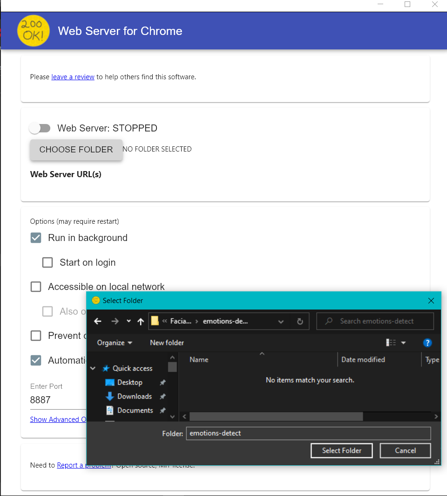
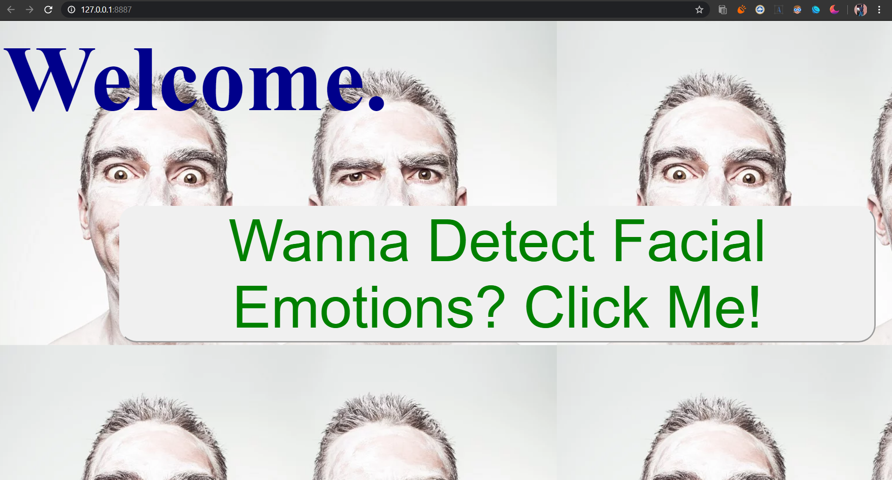
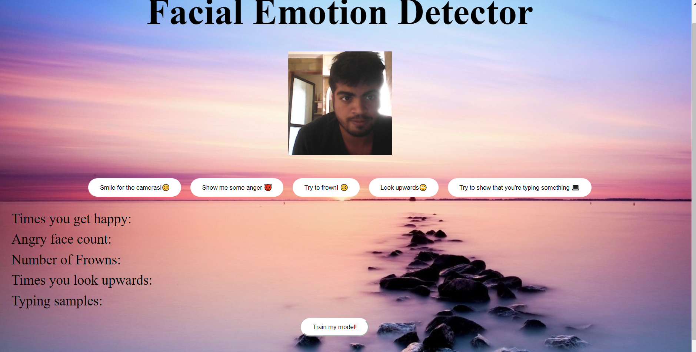
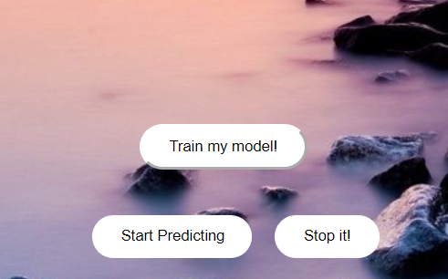
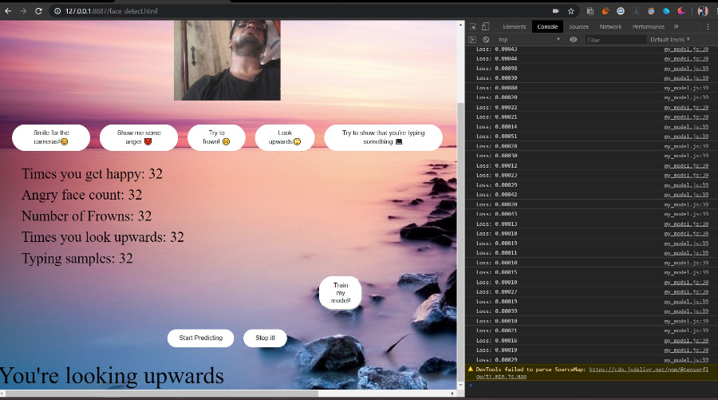

# Facial-Emotion-Detector
This project is a precursor of what is yet to come. Built on mobilenet and Tensorflow.js. 

To use this on your local system
1) Clone the repository using :
   
   git clone https://github.com/sid0312/Facial-Emotion-Detector

2) Download Google Chrome on your system. Instructions are given on the following link

   https://support.google.com/chrome/answer/95346?co=GENIE.Platform%3DDesktop&hl=en
   
3) Add the Web Server Extension to Chrome

  
  
 4) The webserver will be in chrome://apps/
 
 

5) Click on the webserver icon. This should open a dialog box as follows:

6) Navigate to the repository by Clicking on CHOOSE FOLDER

7) Start the Web Server and navigate to the IP address provided by the Web Server. Your home page will be loaded.

8) Navigate to the detector page by clicking on the button prompt. You'll be directed to the main emotion detection module

9) Click on each of the buttons while making the suitable expressions as instructed. To record one sample, left click and release the mouse on that icon. Record atleast 30 samples per button . After performing this, click on "Train my model". The model has started to train

10) An alert will appear after the model has completed training. Click on Start Predicting to begin real-time expression and emotion prediction of your face. Click on stop predicting to turn off the predictions. 

