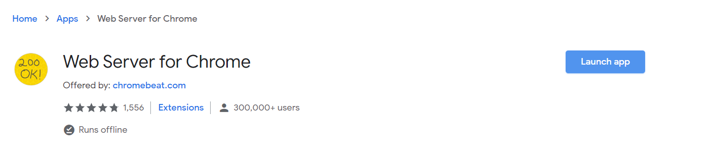
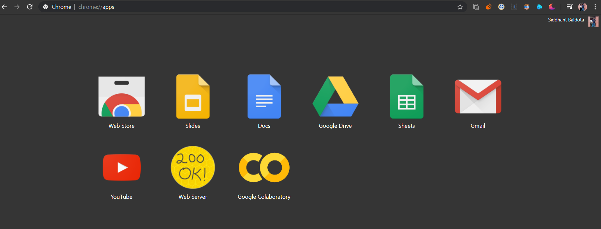
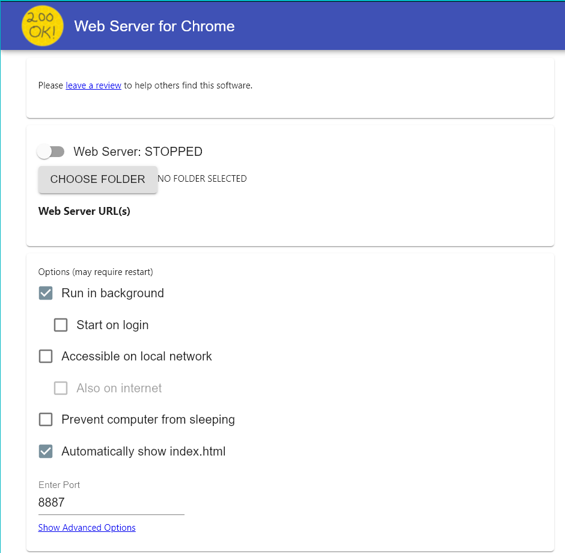

# Facial-Emotion-Detector
This project is a precursor of what is yet to come. Built on mobilenet and Tensorflow.js. 

To use this on your local system
1) Clone the repository using :
   
   git clone https://github.com/sid0312/Facial-Emotion-Detector

2) Download Google Chrome on your system. Instructions are given on the following link

   https://support.google.com/chrome/answer/95346?co=GENIE.Platform%3DDesktop&hl=en
   
3) Add the Web Server Extension to Chrome

  
  
 4) The webserver will be in chrome://apps/
 
 

5) Click on the webserver icon. This should open a dialog box as follows:

